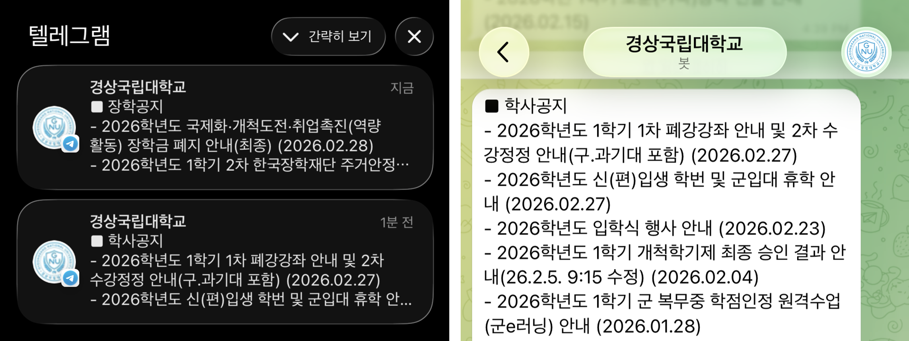
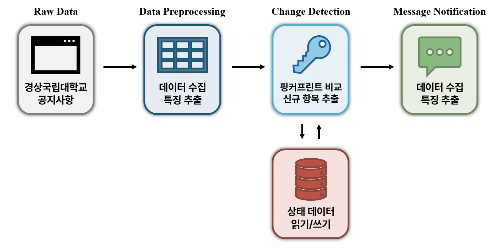

  <h1>GNU-Alarm: 경상국립대학교 공지사항 알림봇</h1>
  
  
    
      <a>경상국립대학교 AI정보공학과 박정준</a>
  

 

|  |
|:--:| 
| **공지사항 알림봇 사용 화면** |

 

경상국립대학교 웹사이트의 주요 공지 게시판(학사, 장학, 교내, 교외)을 주기적으로 수집하고, **신규 게시물 발생(또는 목록 변화)** 시 **Telegram 메시지로 자동 통지**하는 경량 모니터링 봇입니다. 필요한 분들은 **자유롭게 사용/포크/수정**해서 쓰셔도 됩니다.

## 1. 대상 게시판

현재 모니터링하는 게시판은 다음과 같습니다.

- 학사: `https://www.gnu.ac.kr/main/na/ntt/selectNttList.do?mi=1127&bbsId=1029`
- 장학: `https://www.gnu.ac.kr/main/na/ntt/selectNttList.do?bbsId=1075&mi=1376`
- 교내기관: `https://www.gnu.ac.kr/main/na/ntt/selectNttList.do?bbsId=1028&mi=1126`
- 외부기관: `https://www.gnu.ac.kr/main/na/ntt/selectNttList.do?bbsId=1033&mi=1132`

코드 상에서는 `BOARDS` 상수로 관리합니다.

---

## 2. 동작 원리

|  |
|:--:| 
| **전체 동작 방식** |

본 시스템의 파이프라인은 다음과 같습니다.

1. **HTML 수집**: `requests.get()` + User-Agent 지정  
2. **파싱 및 항목 추출**: `BeautifulSoup(lxml)`로 `table tbody tr` 기반 파싱  
3. **휴리스틱 제목 추정**:
   - 행의 셀(`td`) 텍스트 중 숫자/공지/날짜/조회수 등 노이즈를 제거하고  
   - 남은 후보 중 **가장 긴 문자열을 제목(title)** 로 선정
4. **안정적 ID(stable_id) 생성**:
   - `row_key`(앞쪽 컬럼 일부) + title + date + board_url을 결합하여 SHA-1 해시 → 앞 12자리 사용
5. **fingerprint 계산 및 비교**
6. **신규 항목 목록 생성**
7. **Telegram 전송**
8. **state.json 갱신 저장**

---

## 3. 실행 방법 (Automation with GitHub Actions)
본 프로젝트는 GitHub Actions를 통해 정해진 주기로 watch_notices.py를 실행하고, 변경 감지 시 Telegram으로 알림을 전송하도록 설계되었습니다.

#### 3.1 Repository Secrets 등록
GitHub 저장소 → `Settings` → `Secrets and variables` → `Actions` → `New repository secret`에서 아래를 추가합니다.
- `TELEGRAM_BOT_TOKEN`
- `TELEGRAM_CHAT_ID`

#### 3.2 상태 파일(state.json) 커밋
본 시스템은 `state.json`에 상태를 저장합니다.
GitHub Actions 환경에서는 실행 결과에 따라 `state.json`이 갱신되며, 워크플로우에서 이를 커밋/푸시하도록 구성할 수 있습니다.

## 4. 연락처
관련하여 궁금한 사항이 있으신 경우 아래로 연락해 주시기 바랍니다.

- 개발자: 박정준 ([LinkedIn](https://www.linkedin.com/in/jeong-jun-park/))
- 전자우편: [cluster@gnu.ac.kr](mailto:cluster@gnu.ac.kr)
